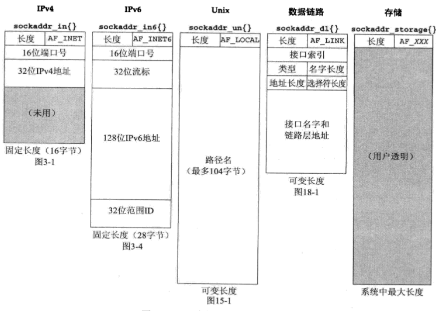

## sockaddr结构分析

### IPv4套接字地址结构 struct sockaddr_in

`struct sockaddr_in`的长度是16字节，可以通过sizeof函数验证

```
/* Structure describing an Internet (IP) socket address. 
   IP套接字地址结构 */
#define __SOCK_SIZE__	16		/* sizeof(struct sockaddr)	*/
struct sockaddr_in
{
  sa_family_t	 sin_family;	/* Address family 地址族，值为AF_INET */
  in_port_t	 sin_port;	/* Port number 端口号，16位TCP或者UDP端口号，网络字节序 */
  struct in_addr sin_addr;	/* Internet address 地址。这是一个结构，而不仅仅是一个in_addr_t类型的无符号长整数，这是有历史原因的。参考unp第70页。 */

  /* Pad to size of `struct sockaddr'. 补全结构体的长度到struct sockaddr一样的值 */
  unsigned char  __pad[__SOCK_SIZE__ - sizeof(short int)
			- sizeof(unsigned short int) - sizeof(struct in_addr)];
};
```

其中

```
typedef __sa_family_t sa_family_t; /* 16bit */
typedef __uint16_t __sa_family_t;

typedef	__uint16_t	in_port_t;   /* 16bit */

/* Internet address. 地址 */
struct in_addr
{
  in_addr_t s_addr;   /* 32位IPv4地址，网络字节序 */
};
typedef	__uint32_t	in_addr_t;	/* base type for internet address 地址的基础类型 */
```

### POSIX规范要求的数据类型

|数据类型|说明|头文件|
|--|--|--|
| int8_t | 带符号的8位整数 | <sys/types.h> |
| uint8_t | 无符号的8位整数 | <sys/types.h> |
| int16_t | 带符号的16位整数 | <sys/types.h> |
| uint16_t | 无符号的16位整数 | <sys/types.h> |
| int32_t | 带符号的32位整数 | <sys/types.h> |
| uint32_t | 无符号的32位整数 | <sys/types.h> |
| sa\_family\_t | 套接字地址结构的地址族 | <sys/socket.h> |
| socklen_t | 套接字地址结构的长度，一般为32位 | <sys/socket.h> |
| in\_addr\_t | IPv4地址，一般为uint32_t | <netinet/in.h> |
| in\_port\_t | TCP或者UDP端口，一般为uint16_t | <netinet/in.h> |

### 通用套接字地址结构 struct sockaddr

```
struct sockaddr {
  sa_family_t		sa_family;	/* 地址族 address family, 值为AF_xxx	*/
  char			sa_data[14];	/* 14 bytes of protocol address 14字节的协议地址	*/
};
```

### IPv6套接字地址结构 struct sockaddr_in6

```
struct sockaddr_in6
{
  sa_family_t	  sin6_family;		/* 值为AF_INET6 */
  in_port_t	  sin6_port;		/* Port number 端口号，网络字节序 */
  uint32_t	  sin6_flowinfo;	/* Traffic class and flow inf.  流信息，未定义 */
  struct in6_addr sin6_addr;		/* IPv6 address. IPv6地址，网络字节序 */
  uint32_t	  sin6_scope_id;	/* Set of interfaces for a scope. */
};
```

其中

```
struct in6_addr
{
  union
    {
      uint8_t 	  __s6_addr[16];
      uint16_t 	  __s6_addr16[8];
      uint32_t 	  __s6_addr32[4];
    } __u6;
#define s6_addr		__u6.__s6_addr  /* 128位的IPv6地址 */
#define s6_addr16	__u6.__s6_addr16
#define s6_addr32	__u6.__s6_addr32
};
```

### 新的通用套接字地址结构 struct sockaddr_storage

不像struct sockaddr，新的struct sockaddr_storage足以容纳系统所支持的任何套接字地址接口。struct sockaddr_storage接口在<netinet/in.h>头文件中定义。

除了ss\_family, struct sockaddr\_storage结构中的其他字段对于用户来说是透明的，struct sockaddr\_storage结构必须类型强制转换成或者复制到适合于ss_family字段所给出的地址类型的套接字地址结构中，才能方伟其他字段。

```
/* Definition of sockaddr_storage according to SUSv3. */
#define _SS_MAXSIZE 128			/* Maximum size. */
#define _SS_ALIGNSIZE (sizeof (int64_t))/* Desired alignment. */
#define _SS_PAD1SIZE (_SS_ALIGNSIZE - sizeof (sa_family_t))
#define _SS_PAD2SIZE (_SS_MAXSIZE - (sizeof (sa_family_t) \
		      + _SS_PAD1SIZE + _SS_ALIGNSIZE))

struct sockaddr_storage {
  sa_family_t		ss_family;
  char			_ss_pad1[_SS_PAD1SIZE];
  int64_t		__ss_align;
  char			_ss_pad2[_SS_PAD2SIZE];
};
```

### 不同套接字地址结构比较

