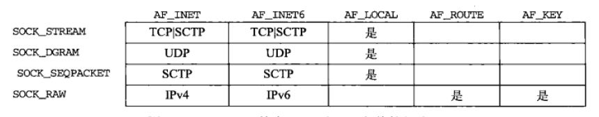

## socket()函数的参数

socket()函数的原型是：

```
#include <sys/socket.h>
int socket(int domain, int type, int protocol);
```

参考了[http://man7.org/linux/man-pages/man3/socket.3p.html](http://man7.org/linux/man-pages/man3/socket.3p.html)

这和《Linux_UNIX系统编程手册》中的参数名称是一致的，而在《Unix网络编程协议卷1：套接字联网API》中，函数原型是

```
#include <sys/socket.h>
int socket(int family, int type, int protocol);
```

前者`domain`参数指定了`socket的通信domain`，后者`family`参数指明了协议族。

然后翻看了一下头文件，看到`AF_xxx`和`PF_xxx`已经统一了

```
/* Supported address families. 支持的地址族 */
/*
 * Address families. 地址族
 */
#define AF_UNSPEC       0               /* unspecified */
#define AF_UNIX         1               /* local to host (pipes, portals) */
#define AF_LOCAL        1               /* POSIX name for AF_UNIX */
#define AF_INET         2               /* internetwork: UDP, TCP, etc.    用于UDP、ECP等 */
#define AF_IMPLINK      3               /* arpanet imp addresses */
#define AF_PUP          4               /* pup protocols: e.g. BSP */
#define AF_CHAOS        5               /* mit CHAOS protocols */
#define AF_NS           6               /* XEROX NS protocols */
#define AF_ISO          7               /* ISO protocols */
#define AF_OSI          AF_ISO          /* OSI is ISO */
#define AF_ECMA         8               /* european computer manufacturers */
#define AF_DATAKIT      9               /* datakit protocols */
#define AF_CCITT        10              /* CCITT protocols, X.25 etc */
#define AF_SNA          11              /* IBM SNA */
#define AF_DECnet       12              /* DECnet */
#define AF_DLI          13              /* Direct data link interface */
#define AF_LAT          14              /* LAT */
#define AF_HYLINK       15              /* NSC Hyperchannel */
#define AF_APPLETALK    16              /* AppleTalk */
#define AF_NETBIOS      17              /* NetBios-style addresses */
#define AF_INET6        23              /* IP version 6     IPv6版本 */

#define AF_MAX          32
/*
 * Protocol families, same as address families for now.
 * 协议族，暂时和地址族是一样的
 */
#define PF_UNSPEC       AF_UNSPEC
#define PF_UNIX         AF_UNIX
#define PF_LOCAL        AF_LOCAL
#define PF_INET         AF_INET
#define PF_IMPLINK      AF_IMPLINK
#define PF_PUP          AF_PUP
#define PF_CHAOS        AF_CHAOS
#define PF_NS           AF_NS
#define PF_ISO          AF_ISO
#define PF_OSI          AF_OSI
#define PF_ECMA         AF_ECMA
#define PF_DATAKIT      AF_DATAKIT
#define PF_CCITT        AF_CCITT
#define PF_SNA          AF_SNA
#define PF_DECnet       AF_DECnet
#define PF_DLI          AF_DLI
#define PF_LAT          AF_LAT
#define PF_HYLINK       AF_HYLINK
#define PF_APPLETALK    AF_APPLETALK
#define PF_NETBIOS      AF_NETBIOS
#define PF_INET6        AF_INET6

#define PF_MAX          AF_MAX
```

对于`AF_XXX`和`PF_XXX`的区分，可以参考《Unix网络编程协议卷1：套接字联网API》。总的来说，优先使用`AF_`。

> AF\_前缀表示地址族，PF\_前缀表示协议族。历史上曾有这样的想法：单个协议族可以支持多个地址族，PF\_值用来创建套接字，而AF\_值用于套接字地址结构。但实际上，支持多个地址族的协议族从来就未实现过，而且头文件<sys/socket.h>中为一给定协议定义的PF\_值总是与此协议的AF\_值相等。尽管这种相等关系并不一定永远成立，但若有人试图给已有的协议改变这种约定，则许多现存代码都将崩溃。为与现存代码保持一致，本书中我们仅使用AF\_常值，尽管在调用socket时我们可能会碰到PF\_值。

此外，type参数的列表是

```
/* Socket types. */
#define SOCK_STREAM	1		/* stream (connection) socket 字节流套接字	*/
#define SOCK_DGRAM	2		/* datagram (conn.less) socket 数据报套接字	*/
#define SOCK_RAW	3		/* raw socket	原始套接字		*/
#define SOCK_RDM	4		/* reliably-delivered message	*/
#define SOCK_SEQPACKET	5		/* sequential packet socket  有序分组套接字	*/
```

最后附上family和type参数的组合


