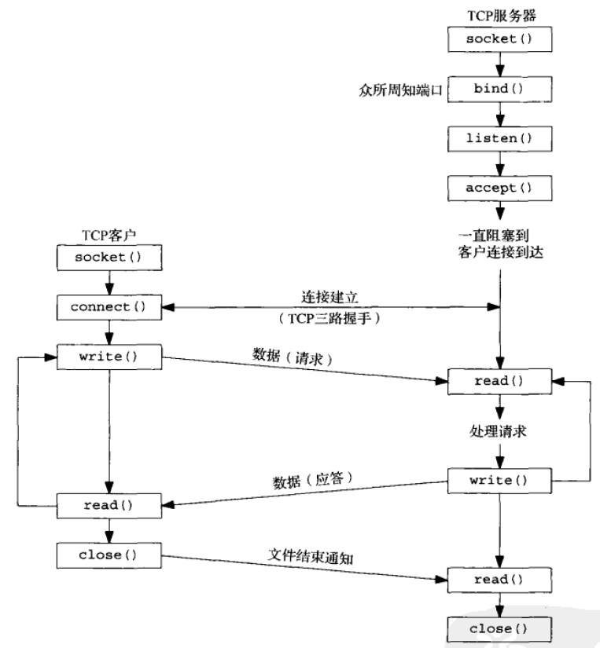

## 基本TCP客户端/服务端程序的套接字交互流程图

- socket() 创建服务端的套接字描述符`server_sock`
- bind() 把一个本地协议地址赋予给一个套接字，即给`serv_sock`设置一下`server_addr`
- listen() 当socket()函数创建一个套接字时，它被假设为一个主动套接字，也就是说，它是一个将调用connect发起连接的客户端套接字。listen函数把一个未连接的套接字转换成为一个被动套接字，指示内核应接受指向该套接字的连接请求。
- accept() 从已完成连接队列队头返回下一个已完成连接。如果已完成连接队列为空，那么进程被投入睡眠。
- close() 关闭套接字

- socket() 创建客户端的套接字描述符`client_sock`
- connect() 客户端使用该函数建立与服务端的连接
- close() 关闭套接字

### 参考

- 《Unix网络编程协议卷1：套接字联网API》